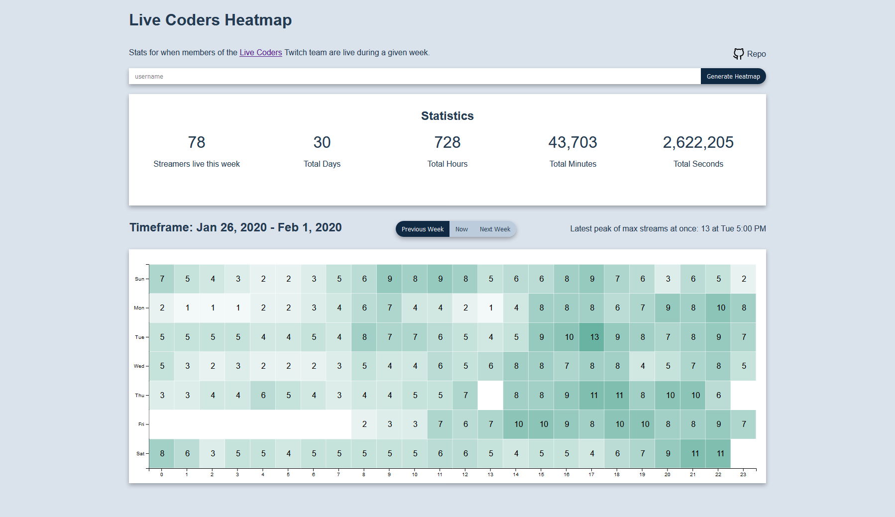

# LiveCoders Heatmap




A Site showcasing a heatmap weekly statistics of when Streamers of the [LiveCoders](https://livecoders.dev) team are live.

The data for this project is sourced from a DynamoDB table on an hourly basis and cached in `site/data.json` in this repo.

## Tools used

- GitHub Actions for the Automations around pulling down the datasets & building and deploying the site.
- D3 for the Heatmap vizualization.
- Parcel for bundling up the JS for production use.

## Setup

To get started with tinkering with the site locally, clone the repo down, install the dependencies, and spin up the dev server.

```sh
git clone https://github.com/lannonbr/LC-Heatmap.git
yarn
yarn run develop
```

This will run `parcel` as a HMR server so whenever you make changes to the various files, the bundle will rebuild and refresh the page live.

If you want to view a production build of the site, run `npm run build`. The outputted site will be dropped into the `dist` folder.
